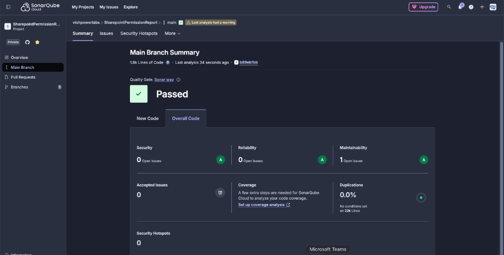
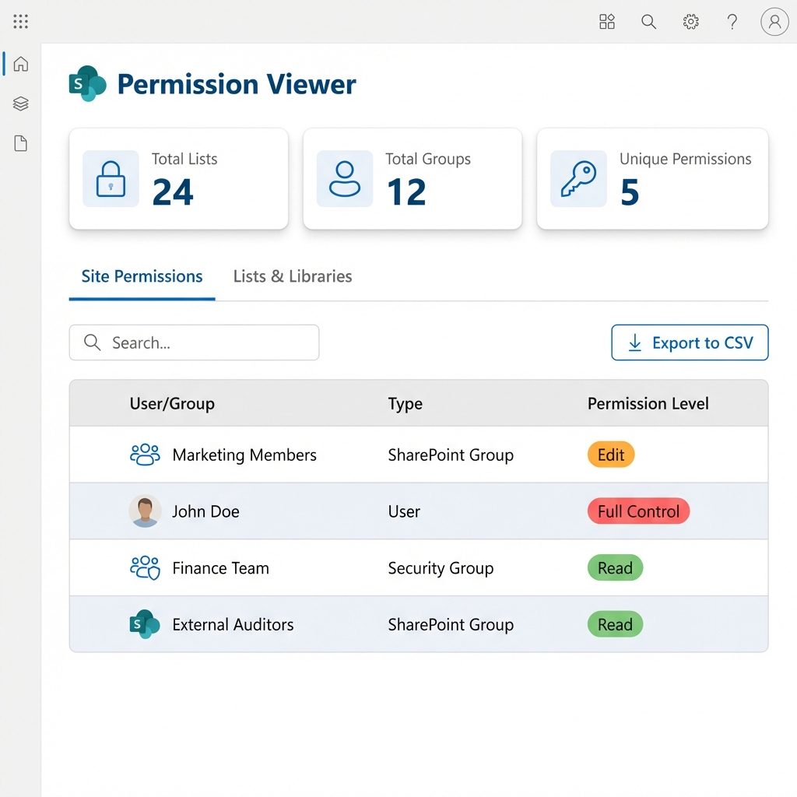
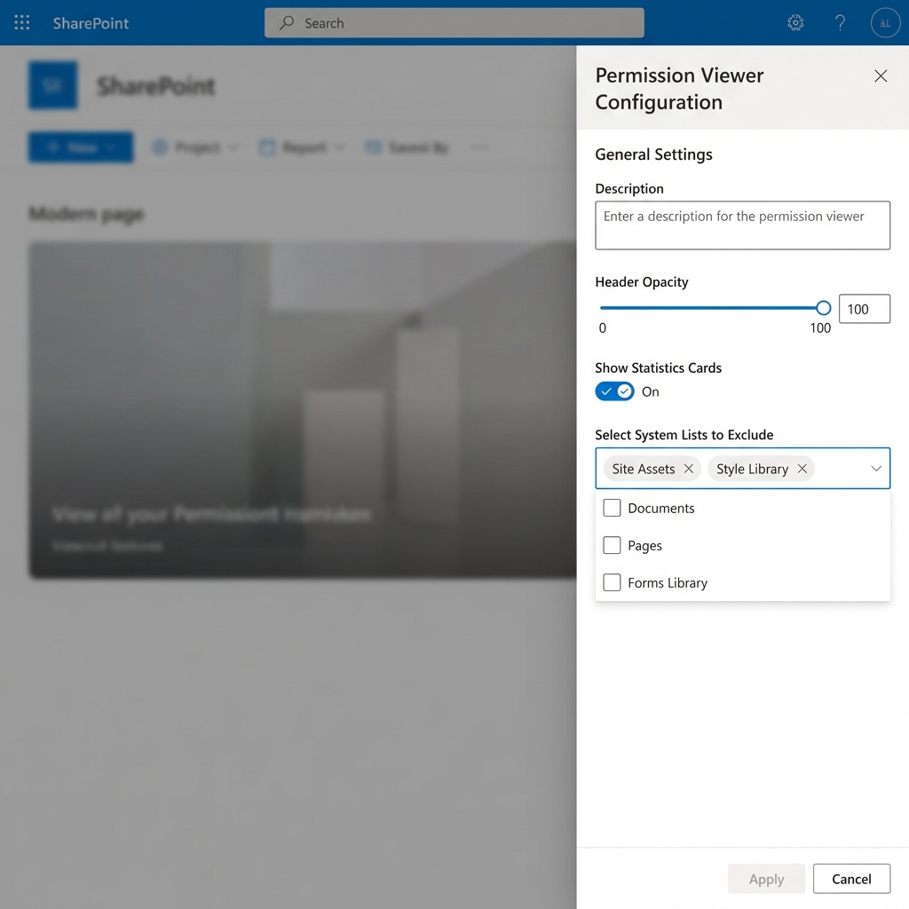

# SharePoint Permission Viewer Web Part

## 1. The Challenge
SharePoint Online is a powerful platform for collaboration, but it comes with a significant gap: **it does not have any out-of-the-box comprehensive report to view and review permissions for sites and libraries.**

Administrators and site owners often struggle to answer simple questions like:
- "Who has access to this site?"
- "Which lists have unique permissions vs. inherited permissions?"
- "What specific permission level does this user have?"

Without a centralized view, managing security becomes a manual, error-prone process involved checking individual lists and libraries one by one.

## 2. The Solution: Permission Viewer Web Part
The **Permission Viewer** web part addresses this challenge by providing a centralized, easy-to-read dashboard of all permissions within a site. It scans your site, lists, and libraries to present a clear picture of who can access what.

> [!WARNING]
> **Performance Note**: This web part is recommended for standard site collections. For huge site collections with a very large number of files and folders in libraries, the analysis might take some time to complete fully.

## 3. Key Features

### 3.1. Centralized Dashboard
The web part provides a "Single Pane of Glass" view for all site security.
- **Statistics Cards**: Get an immediate overview of your site's security posture with cards showing Total Users, SharePoint Groups, count of lists with Unique Permissions, and Orphaned Users.
- **Tabbed Interface**: Easily switch between **Site Permissions** (site-level access) and **Lists & Libraries** (item-level access).

### 3.2. Comprehensive Permission Analysis
- **Visual Permission Indicators**: Color-coded badges makes it easy to spot permission levels at a glance:
    - 🔴 **Full Control** (Red)
    - 🟠 **Edit/Contribute** (Orange)
    - 🟢 **Read** (Green)
- **Inheritance Tracking**: Quickly identify which lists are inheriting permissions from the parent site vs. those that have broken inheritance (Unique permissions).
- **Smart Filtering**: Automatically filters out "Limited Access" noise. The report only shows explicit permission grants (e.g., Read, Edit), so you don't get cluttered with users who only have access to nested items.

### 3.3. Deep Dive Capabilities
- **Deep Clean (Orphaned User Scanner)**: Performs a comprehensive scan of the entire site to identify accounts that are disabled or deleted in Azure AD but still hold permissions. You can remove these invalid permissions directly from the interface.
- **Group & Member Management**: Don't just see "Marketing Members" - click to expand SharePoint groups to reveal the individual users inside. Visually flag orphaned users within groups who are disabled/deleted. **New!** Directly remove users from SharePoint groups instantly from the details panel, streamlining your security management workflow.
- **Deep Scan**: Initiate a **Deep Scan** on any list or library (even inherited ones) to verify every single item. This is critical for catching individual files or folders that may have broken inheritance within an otherwise standard library.
- **Storage Reporting**: Provides enhanced storage reporting with a detailed breakdown panel and support for multiple formats (Auto, MB, GB, TB).

### 3.4. Check Access (Audit View)
- **User Permission Audit**: Instantly search for any user in your organization directory (using the People Picker API) to see their explicit permissions.
- **Deep Scan & Validation**: Validate security by running a "Deep Scan" to find every list or library where the selected user has unique permissions. The tool now provides clear confirmation: "No unique permissions found" means the user is clean.
- **Remove Permissions**: Directly revoke specific permissions or remove users from groups right from the report interface for immediate remediation.

### 3.5. Customization & Export
- **Visual Customization**: Tailor the look and feel of the web part to match your page perfectly.
    - **Font Sizes**: Independently configure font sizes for the Web Part Title, Content (Table headers & rows), and Buttons.
    - **Header Control**: Toggle the display of the web part header component.
    - **Storage Format**: Choose the preferred format for storage display (Auto, MB, GB, TB).
- **Testing Simulator**: Includes a `simulateAccessDenied` configuration to force an "Access Denied" state for testing access behaviors.
- **Configurable Exclusions**: Easily exclude system lists (like 'Site Assets', 'Style Library', 'TaxonomyHiddenList') from the report to focus on business content.
- **CSV Export**: Comprehensive export options for offline analysis, auditing, or archival:
    - **Site-Level Export**: Download all permissions for the site.
    - **Lists & Libraries Export**: Get a summary report of permissions across all lists and libraries.
    - **Deep Scan Export**: When performing a deep scan on a specific list or library, you can export the detailed item-level unique permissions.
- **Search**: Instantly filter the report to find specific users, groups, or lists.

### 3.6. Theme Awareness
The web part is fully **Theme Aware**. It doesn't just sit on the page; it feels like part of the site.
- **Dynamic Styling**: The web part automatically detects the current SharePoint site theme.
- **Adaptive Colors**: Backgrounds, fonts, and primary action buttons (like Export) automatically change their colors to match your selected site appearance (e.g., changing from Blue to Orange theme updates the web part accents instantly).

## 4. How It Works
1.  **Installation**: Deploy the SPFx package to your app catalog and add the web part to a page.
2.  **Configuration**: Use the property pane to configure settings such as:
    *   **Header Opacity**: Adjust the visual style of the header.
    *   **Font Sizes**: Select your preferred size for the Web Part Title (Small to Huge), Content (Small to Extra Large), and Buttons (Small to Huge).
    *   **Show Web Part Header**: Toggle the visibility of the "Permission Viewer" header block.
    *   **Show Statistics**: Toggle summary cards on/off.
    *   **Storage Format**: Toggle the format for storage display (Auto, MB, GB, TB).
    *   **Simulate Access Denied**: Force the "Access Denied" state to safely test administrative error states.
    *   **Excluded Lists**: Select which system lists to ignore in the report.
3.  **Scanning**: Upon loading, the web part uses the SharePoint REST API to fetch site and list permission information. It identifies inheritance status (Unique vs. Inherited) and aggregates role assignments for display.

## 5. Code Quality & Security
Security is paramount when dealing with permission data. This web part has been rigorously analyzed using **SonarQube** to ensure code compliance and security.

### 5.1. SonarQube Analysis
The source code has undergone strict static analysis with the following results:
- **Quality Gate**: Passed ✅
- **Security Issues**: 0 (A Rating)
- **Security Hotspots**: 0
- **Reliability**: 0 Bugs (A Rating)



## 6. Visuals

### 6.1. Web Part Output
The main interface features a clean dashboard with statistics cards, tabs for different views, and a detailed permission table.



### 6.2. Configuration
The web part is highly configurable to suit different needs. Administrators can filter out noise by excluding system lists directly from the property pane.



> [!NOTE]
> *Disclaimer: The mockups shown above are for reference purposes. The actual web part interface may vary slightly in clearity or layout details but will provide the same functionality and look almost similar.*

## 7. Getting Started

### 7.1. Toolchain Prerequisites
To set up this SPFx project locally, ensure your environment meets the following requirements:
- **Node.js**: Version **v22.14.0** or higher.
- **Package Manager**: NPM (included with Node.js).
- **SPFx Tooling**: Use the latest SharePoint Framework version (v1.22.0).

### 7.2. Build & Deploy
This project uses **Heft** for a fast and efficient build process.

1.  **Install Dependencies**:
    ```bash
    npm install
    ```
2.  **Build & Package**:
    Run the following command to clean, build, and package the solution for production:
    ```bash
    npm run build
    ```
    *This executes `heft build --clean --production` and `heft package-solution --production`.*

3.  **Deploy**:
    - Locate the generated `.sppkg` file in the `sharepoint/solution` folder.
    - Upload this file to your **Site Collection App Catalog** (or Tenant App Catalog).
    - Trust the application when prompted.

### 7.3. Scanning Context
> [!IMPORTANT]
> **Context Awareness**: The Permission Viewer web part is context-aware. It automatically scans the **current site collection** where it is deployed and added. It does not scan the entire tenant. To view permissions for a different site collection, you must install and add the web part to a page within that specific site.
