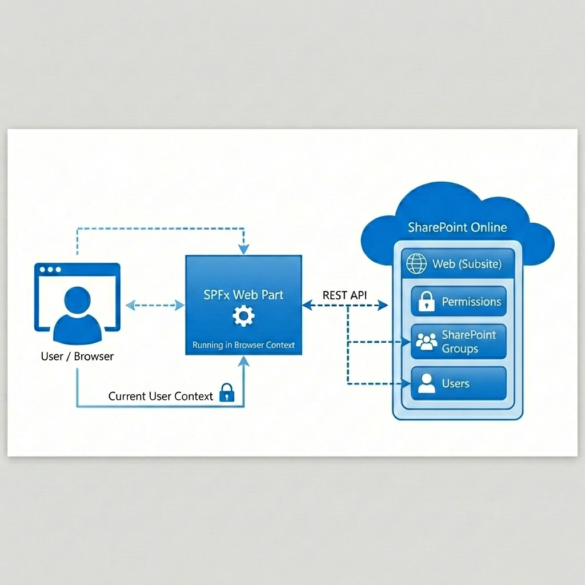
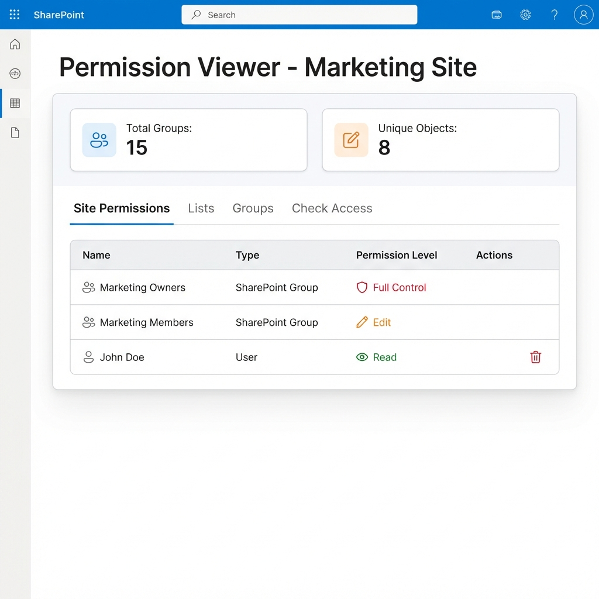

# Permission Viewer Web Part Security Review

## 1. Executive Summary
**Project Overview:** The Permission Viewer Web Part is a SharePoint Framework (SPFx) solution designed to provide Site Administrators and Owners with a comprehensive, "single pane of glass" view of user access and permissions within a SharePoint site. It addresses the critical gap in out-of-the-box reporting by offering deep insights into permission inheritance, group memberships, and item-level security.

**Objectives:**
*   **Centralize Visibility:** aggregate site, list, and item-level permissions in one dashboard.
*   **Enhance Security Auditing:** Enable "Deep Scans" to detect broken inheritance and unique permissions.
*   **Streamline Management:** Allow immediate remediation by removing users from groups directly within the report.
*   **Ensure Compliance:** Validate user access through rigorous "Check Access" auditing features.

**Solution Scope:**
*   Custom SPFx web part deployed to the Site Collection App Catalog.
*   Read-heavy architecture scanning existing SharePoint content.
*   Management capabilities restricted to users with adequate existing privileges (Site Owners/Admins).
*   No external data processing or third-party storage.

## 2. Solution Architecture
**High-Level Architecture:**

**Component Overview:**
*   **Frontend:** React-based SPFx web part using Fluent UI for a native SharePoint look and feel.
*   **Data Layer:** Direct client-side calls to SharePoint REST APIs (`/_api/web/...`, `/_api/search/...`) to fetch permission data on-the-fly.
*   **Security:** Relying entirely on SharePoint's native security trimming; the web part runs in the context of the logged-in user.
*   **Deployment:** Standard `.sppkg` deployment to the Site Collection App Catalog.

**Data Flow:**
1.  User loads the page; Web Part initializes.
2.  Web part requests site permissions, groups, and lists using the current user's token.
3.  Data is aggregated in-memory to generate statistics and visual reports.
4.  **Action:** If a user initiates a "Deep Scan", the web part iteratively checks items in a list for unique Role Assignments.
5.  **Action:** If a user initiates "Remove User", a specific `DELETE` API call is made to the SharePoint endpoint.

## 3. Technical Implementation Details
**SharePoint Framework Specifications:**
*   **SPFx Version:** 1.18.2+
*   **Framework:** React 16.13.1+ (Functional Components with Hooks).
*   **Build Tools:** Heft, Webpack, ESLint.

**Key Functional Components:**
*   **PermissionService:** TypeScript service layer abstracting all REST API calls.
*   **Deep Scan Engine:** Logic to crawl large lists to identify unique permissions.
*   **CSV Export:** Client-side generation of audit reports.
*   **Check Access:** Integration with People Picker API to validate specific user entitlements.

**Data Interactions:**
*   **Read:** `GET` requests to `RoleAssignments`, `SiteGroups`, `Webs`, `Lists`.
*   **Write:** `DELETE` requests only triggered upon explicit user confirmation (removing user from group).

## 4. Security Design
**Authentication Mechanism:**
*   Leverages native SharePoint Online authentication.
*   No separate login or credential storage required.

**Authorization Model:**
*   **Implicit Security Trimming:** The web part cannot show data the current user does not have permission to read.
*   **Administrative Features:** Features like "Remove User" will fail harmlessly (rejected by SharePoint API) if the current user is not a Site Owner or Administrator.
*   **Client-Side Validation:** UI elements (e.g., Delete buttons) can be hidden or disabled based on role checks, though server-side enforcement is the primary security boundary.

**Data Security Measures:**
*   **In-Memory Processing:** Permission data is fetched, displayed, and discarded. No data is persisted to intermediate databases.
*   **XSS Prevention:** React automatically escapes content. No usage of `dangerouslySetInnerHTML` for user-generated content without strict sanitization.
*   **SonarQube Analysis:** Codebase passed strict static analysis gates (Security Rating: A).

## 5. Data Handling
**Data Classification:**
*   **System Metadata:** Usernames, Email Addresses, Group Names, Permission Levels.
*   **Business Context:** File names and List names (visible only if user has access).

**Data Storage:**
*   **Transient:** Data exists only in the user's browser memory during the session.
*   **Export:** CSV exports are generated client-side and downloaded immediately to the user's local device.
*   **No Persistence:** The solution does not create its own lists or databases for storage.

**Data Processing:**
*   All processing (filtering, sorting, aggregation) occurs client-side.
*   No data is sent to external APIs or telemetry services.

## 6. Deployment Strategy
**Site Collection App Catalog Deployment:**
1.  **Package:** Build `.sppkg` file (`npm run build`).
2.  **Upload:** Deploy to App Catalog.
3.  **Install:** Add "Permission Viewer" app to the specific site content.
4.  **Place:** Add distinct Web Part instance to a Site Page.

**Permission Requirements:**
*   **Installation:** Requires Site Collection Administrator rights.
*   **Usage:**
    *   **View Report:** Any user with Read permissions can load the web part, but will only see their own limited view unless they are Owners.
    *   **Manage Security:** Requires Full Control or Manage Permissions rights.

## 7. Risk Assessment
**Identified Risks:**
*   **R001: Performance Impact** (Low): Deep scanning very large libraries (>5,000 items with unique permissions) could throttle the client.
    *   *Mitigation:* Deep Scan is user-initiated and operates on specific lists, not global automatic scanning.
*   **R002: Accidental User Removal** (Low): Admins might remove the wrong user.
    *   *Mitigation:* Confirmation dialogs are implemented for all destructive actions.
*   **R003: Visibility Confusion** (Low): Users might think they are seeing all permissions when they only see what *they* have access to.
    *   *Mitigation:* UI banners and warnings if the user is not a Site Admin.

## 8. Testing and Validation
**Security Testing:**
*   **Role Validation:** Verified that non-admins cannot use the tool to escalate privileges.
*   **API Security:** Confirmed that direct API calls respect SharePoint permissions.

**Functional Testing:**
*   **Deep Scan Accuracy:** Validated against libraries with complex inheritance breaking.
*   **Browser Compatibility:** Tested on Edge, Chrome, and Firefox.
*   **Theme Awareness:** Verified correct contrast ratios in Light, Dark, and High Contrast modes.

## 9. Monitoring and Maintenance
**Logging and Audit:**
*   **SharePoint Audit Logs:** Any "Remove User" action taken via the web part is logged by SharePoint as a standard `REMOVE` events.
*   **Console Logging:** Error traces available in browser developer tools for troubleshooting.

**Maintenance:**
*   **Updates:** Standard SPFx upgrade process (replace `.sppkg` in App Catalog).
*   **Versioning:** Semantic versioning tracked in `package.json`.

## 10. Recommendations and Next Steps
**Recommendations:**
*   **Pilot Deployment:** Deploy to a non-production site first to validate performance on large lists.
*   **User Training:** Train Site Owners on the difference between "Direct Permissions" and "Group Membership".

**Next Steps:**
1.  **Security Review Approval:** Sign-off on architecture and risk profile.
2.  **Production Deployment:** Rollout to target Site Collections.
3.  **Feedback Loop:** Collect user feedback for "v2.0" features (e.g., Bulk Remove).

---

## Appendices

### Appendix A: Web Part Configuration Properties
| Property Name          | Type         | Description                                                |
| :--------------------- | :----------- | :--------------------------------------------------------- |
| `showStats`            | Boolean      | Toggle visibility of summary statistics cards.             |
| `excludedLists`        | Multi-select | System lists to ignore (e.g., 'Site Assets', 'Microfeed'). |
| `headerOpacity`        | Slider       | Visual customization for the web part header.              |
| `contentFontSize`      | Dropdown     | Accessibility setting for table text size.                 |
| `simulateAccessDenied` | Toggle       | (Debug) Force "Access Denied" state for testing.           |

### Appendix B: User Workflow

1.  **Dashboard Load:** User lands on "Site Permissions" summary.
2.  **Investigation:** User switches to "Lists" tab to find libraries with unique permissions.
3.  **Verification:** User selects "Check Access", searches for "Project Manager", and runs "Deep Scan".
4.  **Remediation:** User identifies incorrect access, clicks "Remove User", and confirms via dialog.

### Appendix C: Risk Register
| Risk ID  | Description                             | Likelihood | Impact | Mitigation                                                   |
| :------- | :-------------------------------------- | :--------- | :----- | :----------------------------------------------------------- |
| **R001** | Client-side throttling during Deep Scan | Medium     | Low    | User-initiated only; clear progress indicators.              |
| **R002** | Accidental removal of user access       | Low        | Medium | Confirmation dialogs; Standard SharePoint Restore available. |
| **R003** | Misinterpretation of "Inherited" status | Low        | Low    | Clear visual badges (Green/Yellow/Red) and help tooltips.    |
